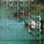
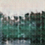
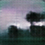
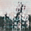
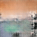
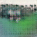
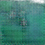
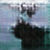
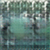
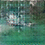

# VideoGan
Implementation of *Generating Videos with Scene Dynamics*.

# Effect
#### Model trained after two epochs







  









# Dependency
- numpy
- imageio
- opencv-python
- tensorflow-gpu(version1.2)

# To Do
- [x] Train the model of videoGan(that is train).
- [x] Generating videos using videoGan(that is test).

# Train
#### Step1
- download the data for training. click → [link](http://www.cs.columbia.edu/~vondrick/tinyvideo/).
```sh
for example, you can download:
<Golf Only> → http://data.csail.mit.edu/videogan/golf.tar.bz2
<List of Golf Files> → http://data.csail.mit.edu/videogan/golf.txt
```
#### Step2
- Unzip the folders that you have downloaded.
```sh
for example, if you have downloaded the data of golf, then you can execute:
"bunzip2 golf.tar.bz2"
"tar xvf golf.tar"
```
#### Step3
- modify config.py according to your needs.
```sh
options explain:
-info: 
	Introduce options.
-batch_size: 
	Number of videos to process in a batch.
-lr_g: 
	Learning rate for generator.
-lr_d: 
	Learning rate for discriminator.
-beta1_g: 
	Beta1 for generator.
-beta1_d: 
	Beta1 for discriminator.
-dis_dim: 
	Scale for discriminator-channel.
-gen_dim: 
	Scale for generator-channel.
-gen_scale: 
	Scale for generator-width and height.
-pic_dim: 
	Dimension of image color.
-noise_dim: 
	Dimension of initial noise vector.
-sample_size: 
	Number of samples to be generated at once(for evaluate).
-mask_L1_lambda: 
	Weight for L1 regularizer of mask.
-trainlogfile: 
	Record the train info(filename).
-modelSaved: 
	Save the trained model(path).
-samplesSaved: 
	Save the sample videos from generator(path).
-max_epoch: 
	Number of training epochs.
-save_interval: 
	Save and test the model each save_interval epochs.
-trainSet: 
	The paths of the videos for training.
-imgSize: 
	The size of img(each frame) in the videos(trainSet).
```
#### Step4
- run "python3 train.py"
```sh
make sure that you have installed all of the dependencies mentioned in Dependency.
you can run "pip install -r requirements.txt" to install these dependencies.
```

# Test
preparing

# Reference
- [*Generating Videos with Scene Dynamics*](http://www.cs.columbia.edu/~vondrick/tinyvideo/)